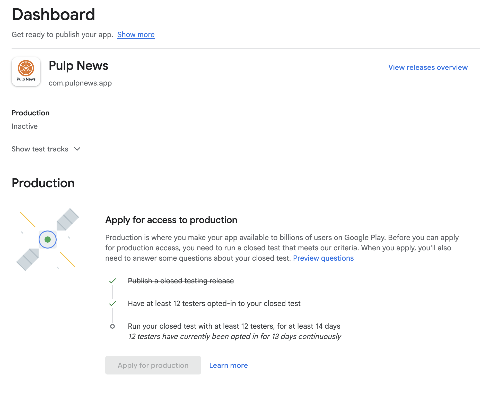

## Pulp News — AI-Powered Local News Aggregator

Pulp News is a cross-platform mobile application built with Flutter that delivers concise, localized news summaries in users' native languages. The app aggregates content from public sources, uses lightweight server-side scraping and retrieval, and leverages language models to produce clear, readable summaries optimized for mobile consumption.

This repository contains the Flutter front-end and backend glue (Firebase, Cloud Functions, and Cloud SQL) used to power realtime updates, authentication, notifications, and summarization orchestration.

## Key Features

- AI-driven article summarization (LLM-backed) with configurable summary lengths
- Local language support and transliteration where applicable
- Personalized feeds and topic-based subscriptions
- Background content refresh and real-time updates via Firebase Cloud Messaging (FCM)
- Offline caching with Hive for fast startup and reduced data usage
- Anonymous and social authentication via Firebase Auth

## Architecture & Backend Capabilities

- Frontend: Flutter app using GetX for state management and routing, Hive for local storage, and platform channels where necessary.
- Auth: Firebase Authentication (anonymous and federated providers). Auth state is exposed through a `GetxService` (`lib/services/auth_service.dart`) for centralized access.
- Notifications: Firebase Cloud Messaging for push notifications and topic-based subscriptions.
- Scraping & Summarization: Server-side scrapers (deployed as Cloud Functions) fetch and normalize content. The summarization pipeline calls a language model via OpenRouter (or other LLM providers) to generate summaries, then stores results in Cloud SQL for downstream consumption.
- Scheduling & Orchestration: Cloud Functions / Cloud Scheduler trigger scraping and summarization jobs at configurable intervals.
- Storage: Cloud SQL for structured article & summary metadata; Hive for local, on-device caching.
- Analytics & Monitoring: Firebase Analytics + Crashlytics for crash and usage telemetry. Use GCP monitoring for backend health and Cloud Functions logs.

## Local Setup (Quickstart)

1. Install Flutter SDK: https://docs.flutter.dev/get-started
2. Install dependencies:

	flutter pub get

3. Configure Firebase for local development (do not commit credentials). Instead, place `google-services.json` and `GoogleService-Info.plist` locally (ignored by git) or use environment-based injection.
4. Run the app:

	flutter run

## Screenshots & Demo

Below are screenshots of the app pages (Home, Explore, Category) and a short demo video showing the app in action.

Home page (fast personalized feed):

Explore page (discover topics and sources):

Category page (local language summaries):

Closed testing badge:

Demo video (short walk-through):

> Release status: Pulp News is currently in closed testing. The app is scheduled for production release in a few days — monitoring feedback and stability before rolling out publicly.

